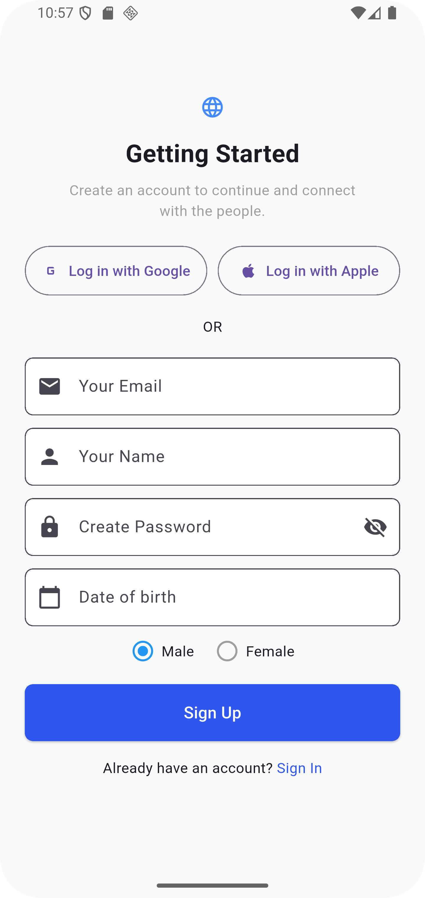
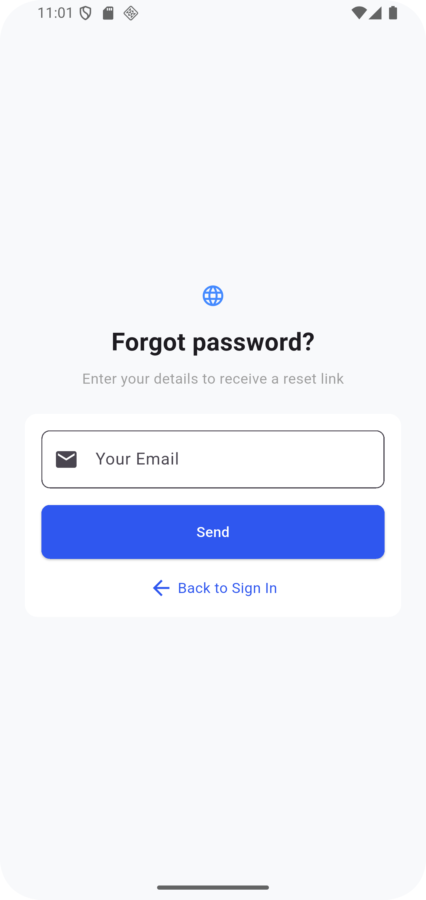

# Meetmax Authentication UI – Flutter

A clean and responsive **Flutter UI** for mobile authentication based on a Figma design.  
This project includes the essential screens for user login and registration flow:

- ✅ **Sign In Screen**
- ✅ **Sign Up Screen**
- ✅ **Forgot Password Screen**
- 🔄 Seamless Navigation between screens

This UI is ready for backend integration with services like **Firebase**, **REST APIs**, or any custom authentication system.

---

## 📱 Screens

| Sign In | Sign Up | Forgot Password |
|--------|--------|-----------------|
|  |  |  |

> *Screenshots based on the original Figma layout*

---

## 🚀 Getting Started

Make sure you have Flutter installed. Then:

```bash
git clone https://github.com/yourusername/meetmax_auth_ui.git
cd meetmax_auth_ui
flutter pub get
flutter run
